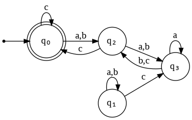
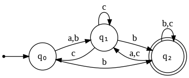

# TPC 02

**Pergunta 1**: A palavra `aabbcc` é aceite pelo autómato finito determinístico (DFA) abaixo?

**Resposta**: Verdadeiro

**Pergunta 2**: A palavra `aabbcc` é aceite pelo autómato finito não-determinístico (NFA) abaixo?

**Resposta**: Falso

